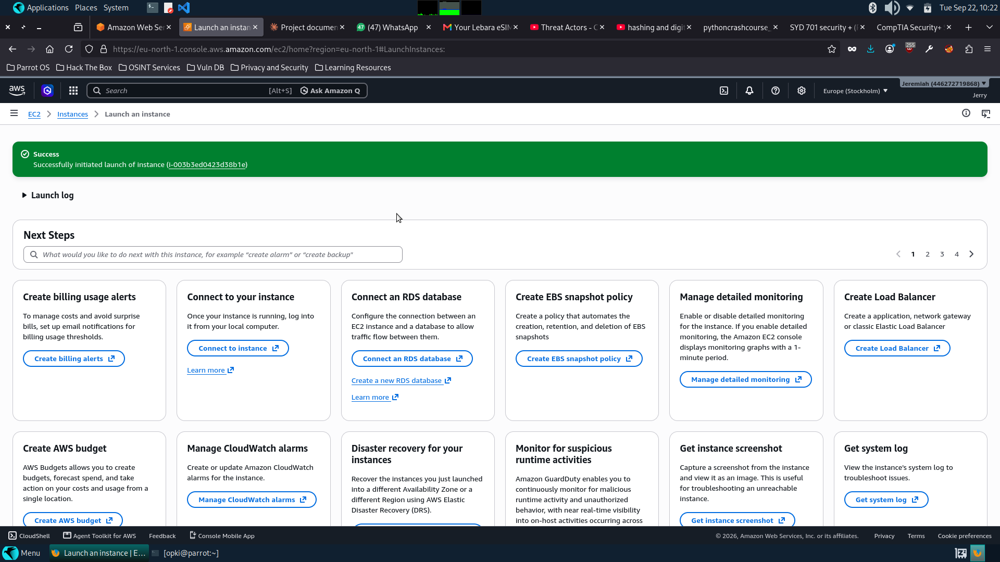
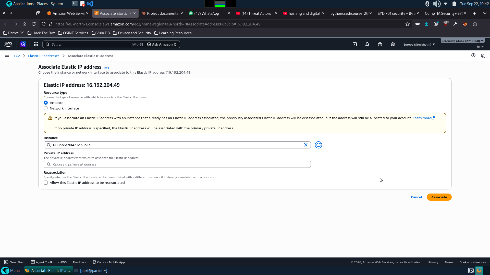
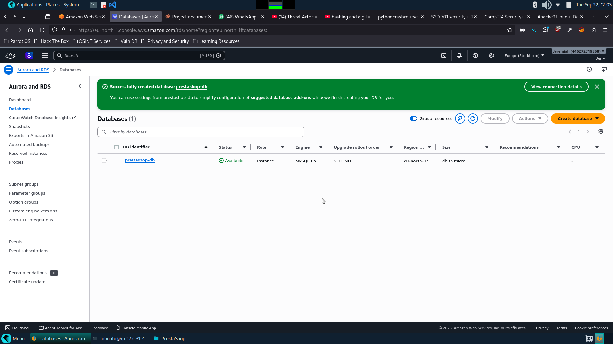
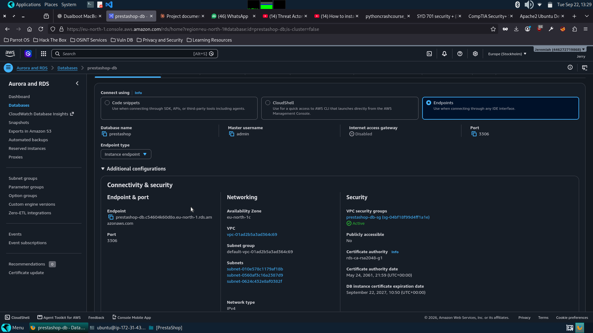

# Preliminary Assignment for Cyber Security
## PrestaShop Deployment on AWS

**Name:** Oguntade Jeremiah Olayinka   
**Date:** September 22, 2026  

---

## Table of Contents

1. [Project Overview](#1-project-overview)
2. [Architecture Design](#2-architecture-design)
3. [AWS Infrastructure Setup](#3-aws-infrastructure-setup)
   - [3.1 EC2 Instance (Web Server)](#31-ec2-instance-web-server)
   - [3.2 Elastic IP Allocation](#32-elastic-ip-allocation)
   - [3.3 RDS Instance (Database Server)](#33-rds-instance-database-server)
   - [3.4 Security Group Configuration](#34-security-group-configuration)
4. [Server Configuration](#4-server-configuration)
   - [4.1 SSH Access](#41-ssh-access)
   - [4.2 System Updates and Swap File](#42-system-updates-and-swap-file)
   - [4.3 Apache and PHP Installation](#43-apache-and-php-installation)
5. [PrestaShop Installation](#5-prestashop-installation)
   - [5.1 Downloading PrestaShop](#51-downloading-prestashop)
   - [5.2 Running the Installer](#52-running-the-installer)
   - [5.3 Database Configuration](#53-database-configuration)
6. [Verification and Testing](#6-verification-and-testing)
7. [Security Decisions and Justifications](#7-security-decisions-and-justifications)
8. [Live URLs](#8-live-urls)

---

## 1. Project Overview

This project involves deploying **PrestaShop**, an open-source e-commerce platform, on **Amazon Web Services (AWS)** using the Free Tier. The deployment follows security best practices by separating the web application server from the database server — two distinct instances that communicate over a private network.

**Key Requirements:**
- Create a new server instance and install PrestaShop
- The installation must have a publicly accessible URL
- The database must **not** be hosted on the same server as the application
- Use only the Free Tier of Amazon Web Services

---

## 2. Architecture Design

```
Internet
    │
    ▼
[EC2 Instance - t3.micro]          [RDS Instance - db.t3.micro]
 Ubuntu 24.04 LTS                   MySQL 8.0
 Apache2 + PHP                      prestashop database
 PrestaShop 8.1.7          ◄───────  Port 3306 (private only)
 Public IP: 16.192.204.49           No public access
 Security Group: launch-wizard-1    Security Group: prestashop-db-sg
```

**Key Security Design Decision:**  
The RDS database has **no public access**. Port 3306 (MySQL) is only open to the EC2 instance's private IP (`172.31.43.134/32`). The database is completely unreachable from the internet.

---

## 3. AWS Infrastructure Setup

### 3.1 EC2 Instance (Web Server)

The EC2 instance was launched with the following configuration:

| Parameter | Value |
|-----------|-------|
| Instance Name | `prestashop-web-01` |
| AMI | Ubuntu Server 24.04 LTS |
| Instance Type | t3.micro (Free Tier eligible) |
| Region | eu-north-1 (Stockholm) |
| Storage | 20 GB gp3 |
| Key Pair | `prestashop-key` (RSA, .pem) |
| Security Group | `launch-wizard-1` |

**Security Group Inbound Rules (Web Server):**

| Type | Protocol | Port | Source |
|------|----------|------|--------|
| SSH | TCP | 22 | My IP only |
| HTTP | TCP | 80 | 0.0.0.0/0 |
| HTTPS | TCP | 443 | 0.0.0.0/0 |

> **Security Note:** SSH access is restricted to the administrator's IP only, reducing the attack surface against brute force attacks.

---

> ### 📸 SCREENSHOT 1 — EC2 Launch Success
> **What to show:** The green "Successfully initiated launch of instance" banner with instance ID `i-003b3ed0423d38b1e`  
> **File to use:** `instance.png`
>
> 

---

> ### 📸 SCREENSHOT 2 — EC2 Instance Running
> **What to show:** EC2 Instances page showing `prestashop-web-01` with status **Running** and the public IPv4 address assigned  
> **File to use:** Your screenshot of the running instance
>
> 

---

### 3.2 Elastic IP Allocation

An **Elastic IP address** (`16.192.204.49`) was allocated and associated with the EC2 instance. This ensures the public IP address remains static across instance reboots, providing a consistent public URL for the PrestaShop installation.

**Public URL:** `http://16.192.204.49`

---

> ### 📸 SCREENSHOT 3 — Elastic IP Associated
> **What to show:** Elastic IPs page showing `16.192.204.49` successfully associated with `prestashop-web-01`  
>
> 

---

### 3.3 RDS Instance (Database Server)

A separate RDS instance was created to host the MySQL database, fulfilling the requirement that the database must not be on the same server as the application.

| Parameter | Value |
|-----------|-------|
| DB Instance Identifier | `prestashop-db` |
| Engine | MySQL 8.0 |
| Instance Class | db.t3.micro (Free Tier eligible) |
| Storage | 20 GB gp2 |
| Master Username | `admin` |
| Initial Database Name | `prestashop` |
| Public Access | **No** |
| Security Group | `prestashop-db-sg` |
| Endpoint | `prestashop-db.c54604k60d8o.eu-north-1.rds.amazonaws.com` |

> **Security Note:** Public access was explicitly disabled on the RDS instance. The database is only reachable from within the VPC, specifically from the EC2 web server.

---

> ### 📸 SCREENSHOT 4 — RDS Database Available
> **What to show:** RDS console showing `prestashop-db` with status **Available**  
>
> 

---

> ### 📸 SCREENSHOT 5 — RDS Connectivity Details
> **What to show:** RDS Connectivity & Security tab showing the full endpoint URL and **Publicly accessible: No**  
>
> 

---

### 3.4 Security Group Configuration

Two security groups were configured to enforce network segmentation:

**`prestashop-db-sg` (Database Security Group) — Inbound Rules:**

| Type | Protocol | Port | Source |
|------|----------|------|--------|
| MySQL/Aurora | TCP | 3306 | 172.31.43.134/32 (EC2 private IP only) |

> **Security Note:** This is the most critical security configuration in the project. Port 3306 is only accessible from the EC2 instance's private IP address. No other machine — including the internet, the administrator's laptop, or any other AWS resource — can connect to the database directly. This enforces the principle of **least privilege** and **network segmentation**.

---

> ### 📸 SCREENSHOT 6 — Database Security Group Rules ⭐ CRITICAL
> **What to show:** `prestashop-db-sg` inbound rules page showing port 3306 restricted to `172.31.43.134/32` with the green success banner  
> **File to use:** `wooooo.png` (the security group saved confirmation)  
>
> 

---

> ### 📸 SCREENSHOT 7 — Web Server Security Group Rules
> **What to show:** `launch-wizard-1` inbound rules showing SSH (22), HTTP (80), HTTPS (443)  
>
> 

---

## 4. Server Configuration

### 4.1 SSH Access

After launching the EC2 instance, SSH access was established from the local machine using the downloaded key pair:

```bash
# Set correct permissions on the key file
chmod 400 ~/prestashop-key.pem

# Connect to the EC2 instance
ssh -i ~/prestashop-key.pem ubuntu@16.192.204.49
```

---

> ### 📸 SCREENSHOT 8 — Successful SSH Connection
> **What to show:** Terminal showing the Ubuntu 24.04 LTS welcome message and the prompt `ubuntu@ip-172-31-43-134:~$`  
>
> 

---

### 4.2 System Updates and Swap File

The server was updated and a 2 GB swap file was configured to prevent memory exhaustion during installation (t3.micro has only 1 GB RAM):

```bash
# Update package lists and upgrade installed packages
sudo apt update && sudo apt upgrade -y

# Create a 2GB swap file
sudo fallocate -l 2G /swapfile
sudo chmod 600 /swapfile
sudo mkswap /swapfile
sudo swapon /swapfile

# Make swap permanent across reboots
echo '/swapfile none swap sw 0 0' | sudo tee -a /etc/fstab

# Verify swap is active
free -h
```

**Output of `free -h`:**
```
               total        used        free
Mem:           957Mi        ...
Swap:          2.0Gi        0B         2.0Gi
```

> **Decision:** Adding a swap file is a critical step when running memory-intensive PHP applications on a 1 GB RAM instance. Without it, the Apache/PHP process would be killed by the OOM (Out of Memory) killer during installation.

---

> ### 📸 SCREENSHOT 9 — Swap File Active
> **What to show:** Terminal showing output of `free -h` with **2.0Gi** under Swap  
>
> 

---

### 4.3 Apache and PHP Installation

Apache web server and all required PHP extensions were installed:

```bash
sudo apt install -y apache2 php php-mysql php-curl php-gd php-intl php-mbstring php-xml php-zip php-bcmath unzip
```

Apache was verified to be running:

```bash
sudo systemctl status apache2
```

Apache mod_rewrite was enabled for PrestaShop URL rewriting:

```bash
sudo a2enmod rewrite
sudo systemctl restart apache2
```

---

> ### 📸 SCREENSHOT 10 — Apache Running
> **What to show:** Terminal showing `sudo systemctl status apache2` with **active (running)** highlighted in green  
>
> 

---

> ### 📸 SCREENSHOT 11 — Apache Default Page in Browser
> **What to show:** Browser at `http://16.192.204.49` showing the Apache2 Ubuntu Default Page ("It works!")  
>
> 

---

## 5. PrestaShop Installation

### 5.1 Downloading PrestaShop

PrestaShop 8.1.7 was downloaded and extracted to the Apache web root:

```bash
# Navigate to web root
cd /var/www/html

# Download PrestaShop
sudo wget https://github.com/PrestaShop/PrestaShop/releases/download/8.1.7/prestashop_8.1.7.zip

# Extract the outer zip
sudo unzip prestashop_8.1.7.zip

# Extract the inner PrestaShop package
sudo unzip prestashop.zip

# Set correct file ownership for Apache
sudo chown -R www-data:www-data /var/www/html/
sudo chmod -R 755 /var/www/html/

# Remove default Apache index page
sudo rm /var/www/html/index.html
```

---

> ### 📸 SCREENSHOT 12 — PrestaShop Download
> **What to show:** Terminal showing the wget download progress bar for `prestashop_8.1.7.zip`  
>
> 

---

### 5.2 Running the Installer

The PrestaShop web installer was accessed at `http://16.192.204.49/install/index.php`

**Installation Steps Completed:**

| Step | Status |
|------|--------|
| Language Selection (English) | ✅ |
| License Agreement | ✅ |
| System Compatibility Check | ✅ (one non-critical warning) |
| Store Information | ✅ |
| Content Configuration | ✅ |
| Database Configuration | ✅ |
| Installation | ✅ |

**System Compatibility Note:**  
A non-critical warning was displayed: *"To avoid internationalization data inconsistencies upgrade the symfony/intl component."* This is a version advisory and does not affect functionality.

---

> ### 📸 SCREENSHOT 13 — PrestaShop Installer Welcome Page
> **What to show:** Browser showing the PrestaShop installer language selection page at `http://16.192.204.49/install/index.php`  
>
> 

---

> ### 📸 SCREENSHOT 14 — System Compatibility Check
> **What to show:** Browser showing the compatibility page with all green checkmarks and the non-critical symfony warning  
>
> 

---

> ### 📸 SCREENSHOT 15 — Store Information Page
> **What to show:** Browser showing the Store Information form filled in with store name, admin email etc.  
>
> 

---

### 5.3 Database Configuration

The database configuration page was filled with the RDS connection details:

| Field | Value |
|-------|-------|
| Database server address | `prestashop-db.c54604k60d8o.eu-north-1.rds.amazonaws.com` |
| Database name | `prestashop` |
| Database login | `admin` |
| Tables prefix | `ps_` |
| Public access | No |

---

> ### 📸 SCREENSHOT 16 — Database Connected ⭐ MOST IMPORTANT SCREENSHOT
> **What to show:** Browser showing the database configuration page with the green **"Database is connected"** confirmation message  
> **File to use:** Your screenshot of the green database connected message  
>
> 

---

**Database connection verified independently via terminal:**

```bash
# Connect to RDS from EC2
mysql -h prestashop-db.c54604k60d8o.eu-north-1.rds.amazonaws.com -u admin -p

# List databases
show databases;
```

**Output:**
```
+--------------------+
| Database           |
+--------------------+
| information_schema |
| mysql              |
| performance_schema |
| prestashop         |
| sys                |
+--------------------+
5 rows in set (0.04 sec)
```

---

> ### 📸 SCREENSHOT 17 — MySQL Terminal Connection to RDS
> **What to show:** Terminal showing successful MySQL login to RDS and `show databases;` output listing the `prestashop` database  
>
> 

---

**PHP PDO connection verified:**

```bash
php -r "new PDO('mysql:host=prestashop-db.c54604k60d8o.eu-north-1.rds.amazonaws.com;dbname=prestashop', 'admin', 'PrestaDB@2026');"
# No error = successful PHP-to-database connection
```

---

> ### 📸 SCREENSHOT 18 — PHP PDO Connection Test
> **What to show:** Terminal showing the PHP PDO command returning no errors (blank output = success)  
>
> 

---

## 6. Verification and Testing

After installation, the install directory was removed for security:

```bash
sudo rm -rf /var/www/html/install
sudo rm -rf /var/www/html/Install
```

> **Security Note:** Leaving the install directory accessible after installation is a critical vulnerability. Any visitor could re-run the installer and wipe the database. Removing it immediately is mandatory.

**Final verification:**

| Check | Result |
|-------|--------|
| PrestaShop storefront accessible | ✅ `http://16.192.204.49/index.php` |
| Admin panel accessible | ✅ `http://16.192.204.49/admin973b3cjf1bcfgkd0mxv` |
| Database on separate server | ✅ RDS endpoint confirmed |
| Database not publicly accessible | ✅ Public access disabled on RDS |
| Port 3306 restricted to EC2 only | ✅ Security group rule confirmed |

---

> ### 📸 SCREENSHOT 19 — Installation Complete Page
> **What to show:** Browser showing the PrestaShop installation success/complete page  
>
> 

---

> ### 📸 SCREENSHOT 20 — Live PrestaShop Storefront ⭐
> **What to show:** Browser showing the live PrestaShop store homepage at `http://16.192.204.49/index.php`  
>
> 

---

> ### 📸 SCREENSHOT 21 — Admin Login Page
> **What to show:** Browser showing the PrestaShop admin login page at `http://16.192.204.49/admin973b3cjf1bcfgkd0mxv`  
>
> 

---

> ### 📸 SCREENSHOT 22 — Admin Dashboard
> **What to show:** Browser showing the PrestaShop admin dashboard after successful login  
>
> 

---

## 7. Security Decisions and Justifications

### 7.1 Separate Database Server
The database was hosted on AWS RDS, completely separate from the EC2 web server. Even if the web server is compromised, an attacker cannot directly reach the database without breaking through a second layer of network security.

### 7.2 No Public Access on RDS
The RDS instance was configured with **Public Access: No**. The database has no public IP and cannot be reached from the internet under any circumstances.

### 7.3 Least Privilege Security Groups
Port 3306 on `prestashop-db-sg` only accepts connections from the EC2 instance's private IP (`172.31.43.134/32`). Only the minimum necessary access is granted — the principle of least privilege.

### 7.4 SSH Restricted to Administrator IP
SSH (port 22) on the web server is restricted to the administrator's IP only, preventing brute force attacks from the open internet.

### 7.5 Elastic IP for Stable Public URL
An Elastic IP ensures the public URL never changes even after an instance restart — critical for a production deployment.

### 7.6 Install Directory Removed Post-Installation
The `/install` directory was deleted immediately after setup. Leaving it accessible allows any visitor to re-run the installer and compromise the store.

### 7.7 Swap File Configuration
A 2 GB swap file was added to prevent memory-related crashes on the 1 GB RAM instance during PHP execution.

---

## 8. Live URLs

| Resource | URL |
|----------|-----|
| PrestaShop Store | `http://16.192.204.49/index.php` |
| Admin Panel | `http://16.192.204.49/admin973b3cjf1bcfgkd0mxv` |
| RDS Endpoint | `prestashop-db.c54604k60d8o.eu-north-1.rds.amazonaws.com` |

---

*Documentation prepared by Oguntade Jeremiah Olayinka — Bincom Dev Center Cyber Security Preliminary Assignment, September 2026.*
